# Office Network Design & Monitoring System

## 📌 Project Overview
A complete office network designed in 
Cisco Packet Tracer with Python 
network monitoring tools.

## 🏗️ Part 1 - Network Design (Packet Tracer)
- ✅ LAN Network Setup
- ✅ VLAN Configuration (HR, IT, Admin)
- ✅ Inter VLAN Routing
- ✅ DHCP Server
- ✅ DNS Server
- ✅ HTTP Server
- ✅ Extended ACL
- ✅ NAT/PAT

## 🐍 Part 2 - Network Tools (Python)
- ✅ Chat Application
- ✅ Ping Tool
- ✅ Port Scanner
- ✅ Subnet Calculator
- ✅ Network Scanner

## 🛠️ Technologies Used
- Cisco Packet Tracer
- Python 3.x
- Socket Programming

## 📁 Project Structure
```
office-network-design-monitoring/
├── packet-tracer/
│   └── office_network_FINAL.pkt
├── python-scripts/
│   ├── server.py
│   ├── client.py
│   ├── ping_tool.py
│   ├── port_scanner.py
│   ├── subnet_calculator.py
│   └── network_scanner.py
├── screenshots/
└── README.md
```
## 💡 Concepts Covered
- IP Addressing & Subnetting
- VLANs & Trunking
- Inter VLAN Routing
- DHCP, DNS, HTTP
- Access Control Lists
- NAT/PAT
- Socket Programming
- TCP/IP Protocol

## 📸 Screenshots
Topology:
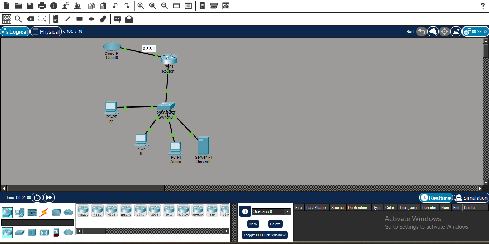

Pc Ping:
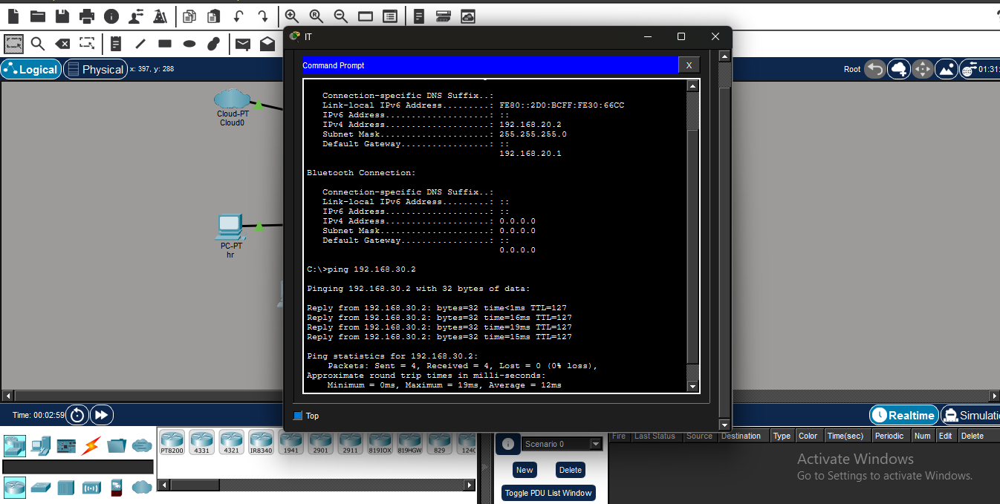

Nat Ping:
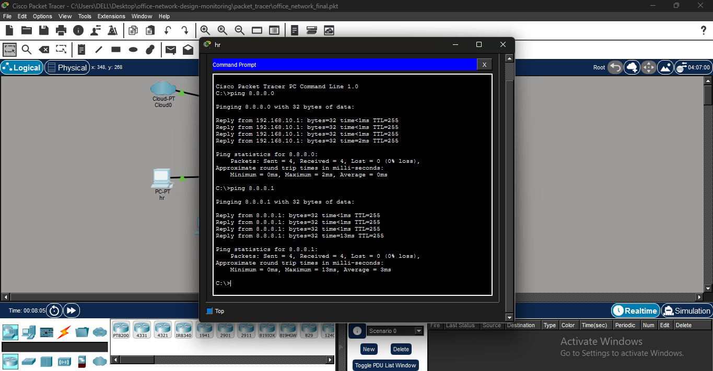

Access List:
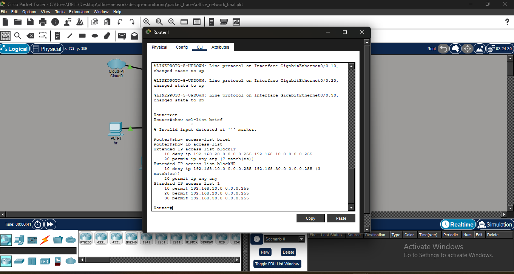

Vlan:
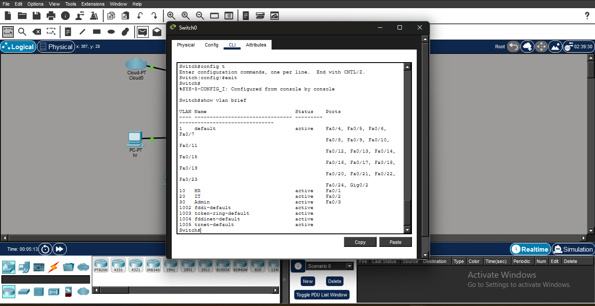

Vlan Pc Ping:
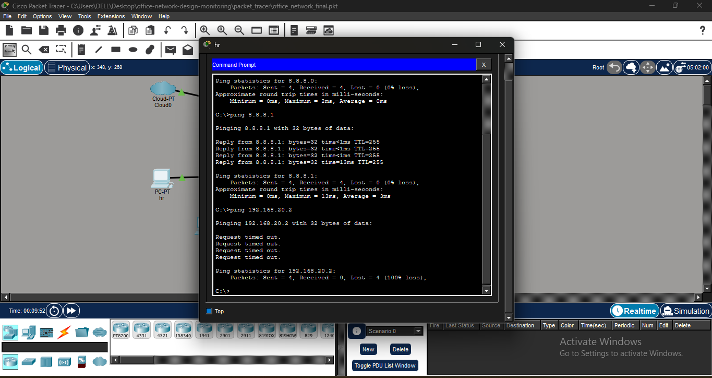

Chat App:
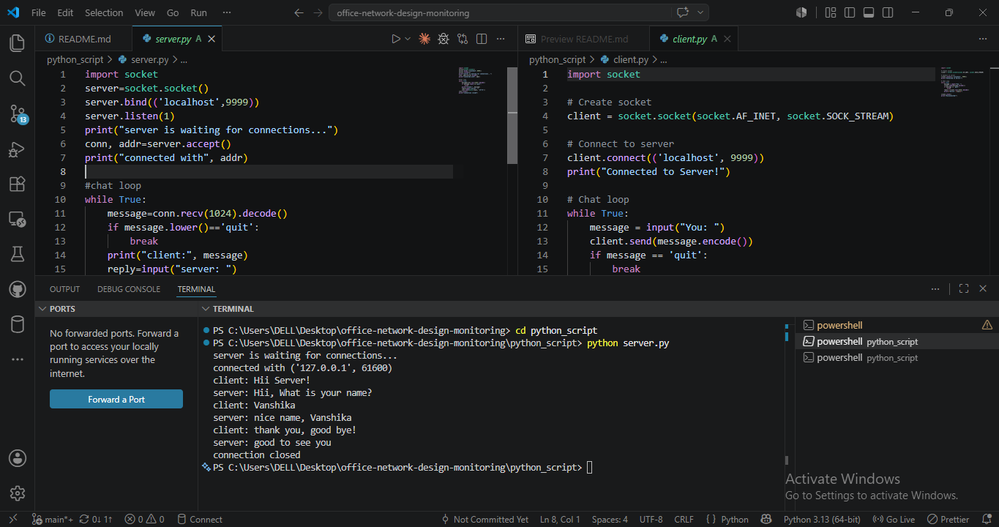

Network Scanner:
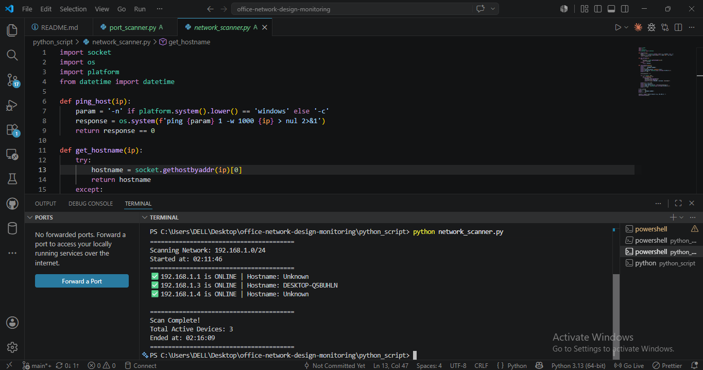

Ping Tools:
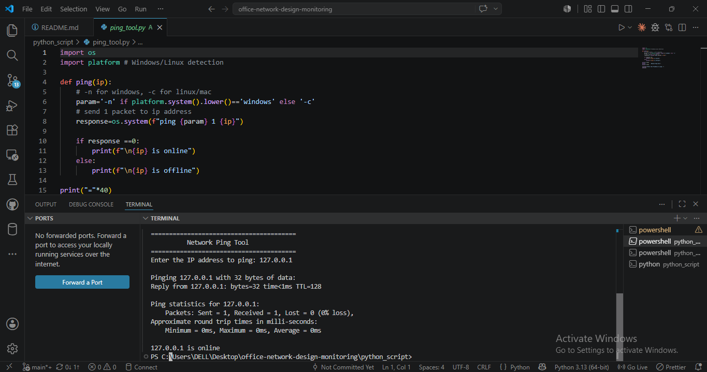

Port Scanner:
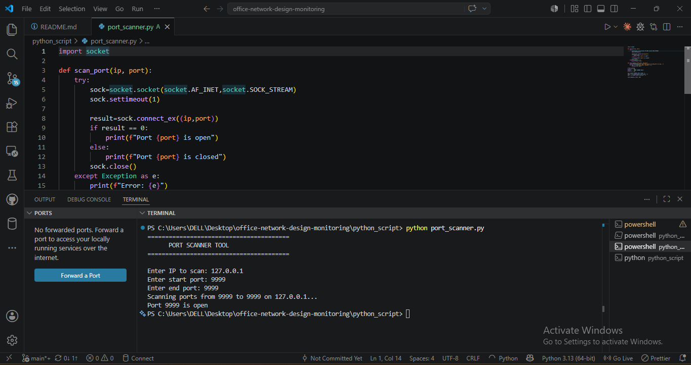

Subnet Calculator:
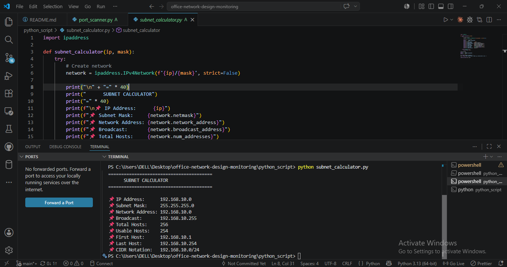

## 🚀 How to Run

### Python Scripts:
```bash
# Ping Tool
python ping_tool.py

# Port Scanner
python port_scanner.py

# Subnet Calculator
python subnet_calculator.py

# Network Scanner
python network_scanner.py

# Chat App
python server.py  # Terminal 1
python client.py  # Terminal 2
```
